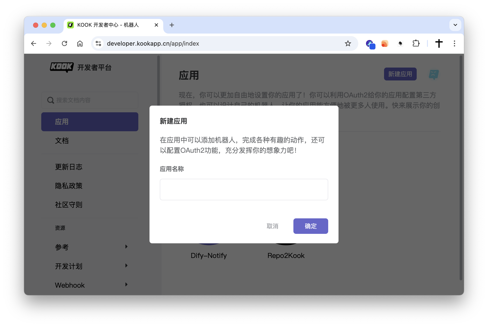
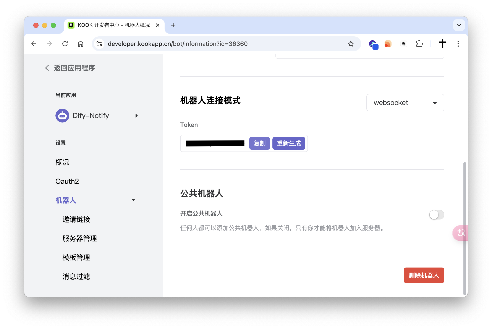
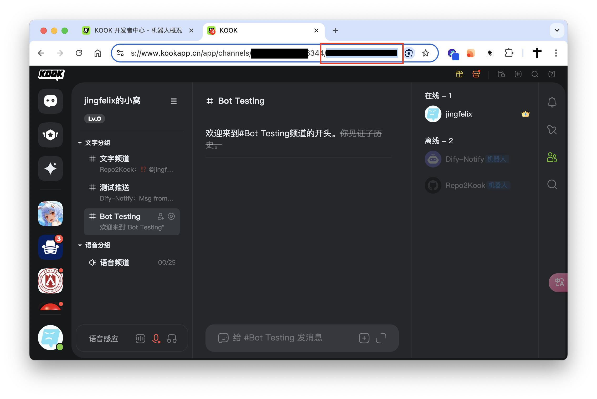
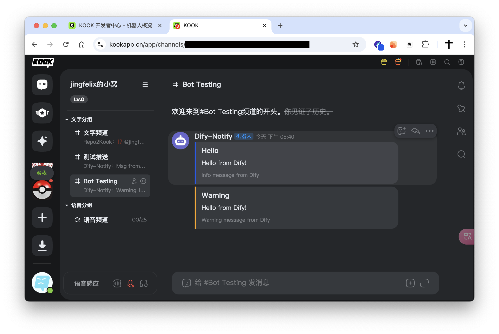

## dify-plugin-kook-notify

**Author:** jingfelix
**Version:** 0.0.1
**Type:** tool

### Description

This plugin allows you to send customizable messages to Kook channels using the Kook API. It supports different message types such as `Info`, `Warning`, `Error`, and `Success`, each with a unique color code. By integrating this tool, you can automate notifications or alerts directly to your Kook server channels.

### Features
- Send messages with a title, content, and type.
- Supports message types with predefined color codes.
- Easy integration with Kook Bot credentials (Token and Channel ID).
- Rich text formatting in [KMarkDown](https://developer.kookapp.cn/doc/kmarkdown).

### Usage

Create your Kook App at :

Get Your Kook Bot Token:

Get Your Kook Channel ID:

Example of sending a message:

### Privacy Policy

Check the [Privacy Policy](PRIVACY.md) for details on how your data is handled.
